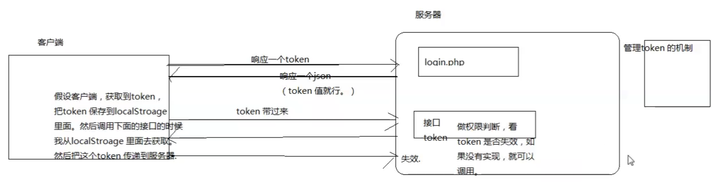

# 1. cookie
## 1.1 cookie概念&原理
+ cookie是浏览器写给客户端的，cookie存储在客户端
```js
// 原理描述
浏览器第一次发送请求到server端，server给浏览器发送一个cookie，这个cookie是在server给浏览器的响应头中，名称是`Set-Cookie`，这个名称的值是个`key-value`的键值对，浏览器拿到server返回的Set-Cookie之后会按照http协议的方式解析，把cookie进行保存；后面浏览器再去请求server时会把这个保存的cookie数据放在请求头中，以`Cookie: key=value`的形式发送给server。
```
## 1.2 cookie声明周期
> 背景: 浏览器怎么cookie？保存多久？
+ `setCookie("key", "value", 失效时间)`
### 1.2.1 内存cookie
+ 存储在浏览器内存中，关闭浏览器，cookie消失；不设置时间默认就是内存cookie
```js
setCookie("key", "value")
```
### 1.2.2 硬盘cookie
+ 存储在硬盘上
```js
// 设置一天后过期
setCookie("key", "value", time()+3600*24)
```
### 1.2.3 追杀cookie
+ 把之前写到客户端的cookie清除掉
```js
// 把cookie的value设置为空，失效时间修改为-1，即为追杀cookie，客户端收到后，会将名为 key 的cookie清除掉
setCookie("key", "", -1)
```
## 1.3 cookie应用场景
```js
// 示例1：记录用户名
client将用户名`username`作为请求参数带到server端，server将`username`设置为cookie，然后将其放到响应头中返回给client；client将cookie中的用户名内容取出设置到用户名输入框中，再次请求时用户就不在需要输入用户名了。
```
## 1.4 cookie缺点
```js
1.cookie 基于浏览器本地存储数据，因此，只有在保存了 cookie 的那个浏览器上能够使用该 cookie。同一设备不同浏览器之间，cookie 不通用。
2. cookie 的存储大小有限制： 4KB 左右。
3. cookie 存在C盘的一个文件中，不同浏览器存储路劲不一样。
4. cookie 是可以被用户手动修改的。
5. cookie 的有效期：默认有效期20分钟左右。可以通过后端强制设置有效期，如自动登录时间。
```

# 2. session
+ session是基于cookie实现的
## 2.1 session原理
```js
// 原理描述
1. client第一次请求server时，server会为client创建一个session，然后将sessionId作为key，session作为value存储在server的session池中（session有生命周期的，php中默认保持24分钟，每访问一次生命周期会被重新激活），然后给client一个响应头，这个响应头就是一个cookie，这个cookie存储的就是sessionId
2. client再次请求server，server根据client传递过来的cookie的sessionId去session池中去查找，获取session就可以拿到session数据
```

## 2.2 会话
### 2.2.1 会话开始标志
+ web会话并不是浏览器开始访问一个网站会话就开始了，而是server创建了session，然后向client响应了一个cookie，cookie中保存了sessionId，这时候会话就开始了
### 2.2.2 会话结束的两种情况：
> 关闭浏览器会话也不会结束
+ 第一种情况：服务器端的session超时没有了，会话会结束
+ 第二种情况：客户端的cookie被清除了，会话会结束，因为session是依赖cookie的

## 2.3 应用
+ 保存用户登录的状态，当我访问1.php时，登录了账号，并将信息保存在server的session中，此时继续访问2.php，这时候2.php就会从session中获取到我的登录状态

# 3. token
+ token和session的区别：都可以作为验证，但是session依赖客户端的cookie，有些客户端不支持cookie，比如微信小程序，ios，andriod等；这种情况下token可以作为验证，比如我们常见的appkey，就是一种token的验证方式；第一次登录申请一个appkey，服务器可将appkey作为json串返回，以后每次访问接口客户端都带着appkey即可作为验证。

