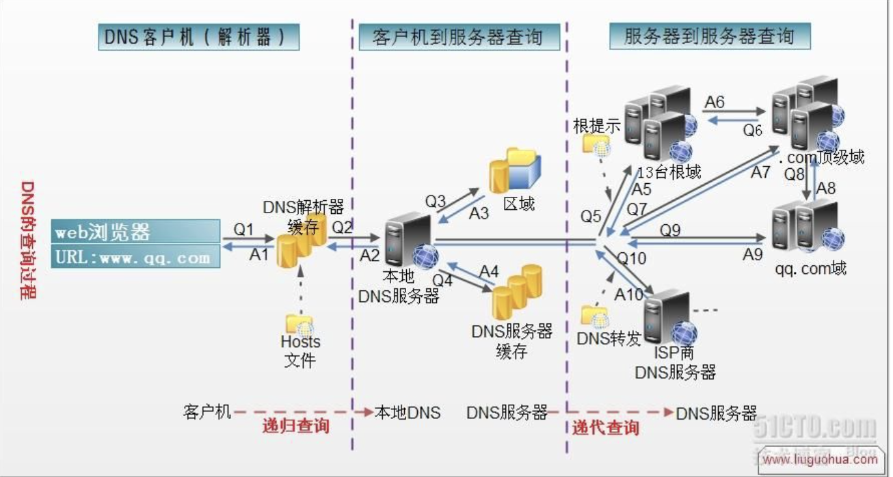
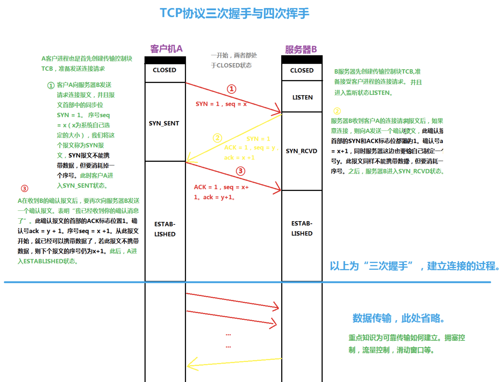
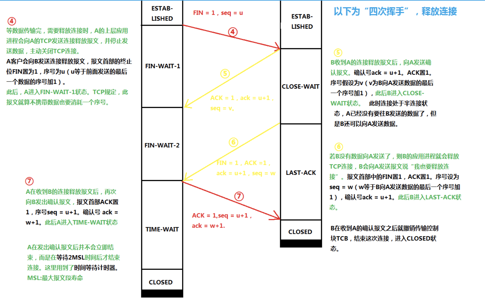
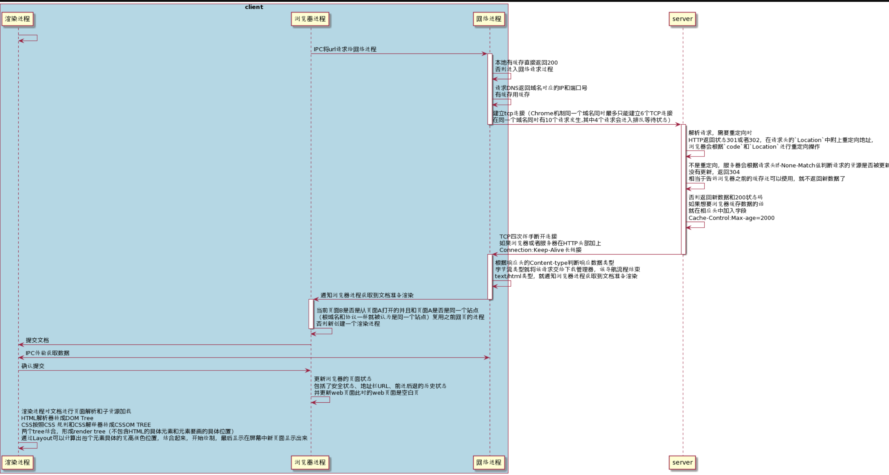

# url请求展示流程
```js
1. 用户输入URL，浏览器会根据用户输入的信息判断是搜索还是网址，如果是搜索内容，就将搜索内容+默认搜索引擎合成新的URL；如果用户输入的内容符合URL规则，浏览器就会根据URL协议，在这段内容上加上协议合成合法的URL
2. 用户输入完内容，按下回车键，浏览器导航栏显示loading状态，但是页面还是呈现前一个页面，这是因为新页面的响应数据还没有获得
3. 浏览器进程构建请求行信息，会通过进程间通信（IPC）将URL请求发送给网络进程
`GET /index.html HTTP1.1`
4. 网络进程获取到URL，先去本地缓存中查找是否有缓存文件，如果有，拦截请求，直接200返回；否则，进入网络请求过程
5. 网络进程请求DNS返回域名对应的IP和端口号，如果之前DNS数据缓存服务缓存过当前域名信息，就会直接返回缓存信息；否则，发起请求获取根据域名解析出来的IP和端口号，如果没有端口号，http默认80，https默认443。如果是https请求，还需要建立TLS连接。(这里是DNS域名解析过程，会现在本地host中查找，没有的话会在最近的域名服务器查找，没有找到的话就会向上级域名服务器查找，这里的查找分两种一种是递归查找，一种是迭代查找，递归是一直向上找，找到才返回，迭代是查找直接返回另一个域名服务器地址，然后接着再去请求返回的域名服务器地址；一般请求根或者顶级域名服务器的时候是迭代查找，这样可以减少根顶级域名服务器的负载)
```


```js
6. Chrome 有个机制，同一个域名同时最多只能建立 6 个TCP 连接，如果在同一个域名下同时有 10 个请求发生，那么其中 4 个请求会进入排队等待状态，直至进行中的请求完成。如果当前请求数量少于6个，会直接建立TCP连接。
7. TCP三次握手建立连接，http请求加上TCP头部——包括源端口号、目的程序端口号和用于校验数据完整性的序号，向下传输
```


```js
8. 网络层在数据包上加上IP头部——包括源IP地址和目的IP地址，继续向下传输到数据链路层；数据链路层会在`mac表`查询下一跳的mac地址，如果查找到，那么直接加在数据包上，未查找到则需要进行`ARP`（ARP地址解析协议是通过ip地址查询mac地址）查找到之后再添加在数据包上，并且记录到本地`mac表`（mac表维护的是ip地址和mac地址的映射关系）
9. 数据链路层结束之后传递到物理层，物理层再将数据流传递出去，经过路由器，一路传递到目的服务器主机
10. 目的服务器主机网络层接收到数据包，解析出IP头部，识别出数据部分，将解开的数据包向上传输到传输层
11. 目的服务器主机传输层获取到数据包，解析出TCP头部，识别端口，将解开的数据包向上传输到应用层
12. 应用层HTTP解析请求头和请求体，如果需要重定向，HTTP直接返回HTTP响应数据的状态`code301或者302`，同时在请求头的`Location`字段中附上重定向地址，浏览器会根据`code`和`Location`进行重定向操作；如果不是重定向，首先服务器会根据 请求头中的`If-None-Match` 的值来判断请求的资源是否被更新，如果没有更新，就返回`304`状态码，相当于告诉浏览器之前的缓存还可以使用，就不返回新数据了；否则，返回新数据，200的状态码，并且如果想要浏览器缓存数据的话，就在相应头中加入字段：
`Cache-Control:Max-age=2000`
响应数据又顺着应用层——传输层——网络层—（数据链路层-物理层-...-物理层-数据链路层）—网络层——传输层——应用层的顺序返回到网络进程
13. 数据传输完成，TCP四次挥手断开连接。如果，浏览器或者服务器在HTTP头部加上如下信息，TCP就一直保持连接。保持TCP连接可以省下下次需要建立连接的时间，提示资源加载速度
`Connection:Keep-Alive`
```


```js
14. 网络进程将获取到的数据包进行解析，根据响应头中的Content-type来判断响应数据的类型，如果是字节流类型，就将该请求交给下载管理器，该导航流程结束，不再进行；如果是text/html类型，就通知浏览器进程获取到文档准备渲染
15. 浏览器进程获取到通知，根据当前页面B是否是从页面A打开的并且和页面A是否是同一个站点（根域名和协议一样就被认为是同一个站点），如果满足上述条件，就复用之前网页的进程，否则，新创建一个单独的渲染进程
16. 浏览器会发出“提交文档”的消息给渲染进程，渲染进程收到消息后，会和网络进程建立传输数据的“管道”，文档数据传输完成后，渲染进程会返回“确认提交”的消息给浏览器进程
17. 浏览器收到“确认提交”的消息后，会更新浏览器的页面状态，包括了安全状态、地址栏的 URL、前进后退的历史状态，并更新web页面，此时的web页面是空白页
18. 渲染进程对文档进行页面解析和子资源加载，HTML 通过HTM 解析器转成DOM Tree（二叉树类似结构的东西），CSS按照CSS 规则和CSS解释器转成CSSOM TREE，两个tree结合，形成render tree（不包含HTML的具体元素和元素要画的具体位置），通过Layout可以计算出每个元素具体的宽高颜色位置，结合起来，开始绘制，最后显示在屏幕中新页面显示出来
```



# 301和302重定向
+ 301和302状态码都表示重定向，就是说浏览器在拿到服务器返回的这个状态码后会自动跳转到一个新的URL地址，这个地址可以从响应的Location首部中获取（用户看到的效果就是他输入的地址A瞬间变成了另一个地址B）——这是它们的共同点。他们的不同在于。301表示旧地址A的资源已经被永久地移除了（这个资源不可访问了），搜索引擎在抓取新内容的同时也将旧的网址交换为重定向之后的网址；302表示旧地址A的资源还在（仍然可以访问），这个重定向只是临时地从旧地址A跳转到地址B，搜索引擎会抓取新的内容而保存旧的网址

```js
http://www.plantuml.com/plantuml/png/dLPRKrDN57xFhyZOrsOQBzC7fksew4oTWcMKlkM164-5cNZYn8FLjt09kLymY844ac0YL4W2L22NXFoOdhNtEK_-XNwPXOS8KcrV8FkoBkjRt_hskVvKS_krwSTUsmFVS_ibZtTAKRLBzcz6fXvDQZUzqufDDFP58MFqSd8hPdVyP1zS3zbjuY1bR8PfPUlqXkmkodR-P3ralpCsJBiBqtwlKJyIUxEolJ9umURsQ5FFt9hoYPcD5-TzSbIHtw7yhiX7P2T3rQpClHV9Yj5Rejpw5QVJfLBwBOLNS9k25RRas4Olz6NdVFNMtVlia0e5IYUetgJMaboTlpD6B-DokqwfDvGwSgcdIInjyG-RJL4VsW7dkJXF5VypnJzaftPBRiSqpnEZjux4FtJ2mvD-tsD5v5iKFgHqN6y4zCOxZeobU7qeyW4ghrBgdJ7NPVFlSMDyU8nTeEJyrWM6aSjEx75Lb5gKIuLlANYeDwhNh6sziyfWYUHBCrkGrGWT1sNqK0HcFdGYjeVAvvjqsZkkpCR_1airDj-8zJH7-T29c_c0yNR632MejahfHUJdKdyU7nzZg3dYLUTb4Lus0i6hpYimGM5iJkNtm7zYnETnQrC-TG8Lc2lpUYDgkGCdQ2q06vTgqHAbYM9J96eJ7jz3PGBDE_M0CenI_3IRJ4BlvZzJXDv8Y6pTkeS08f-WQ6dGlPNZdTyTTtsguXXrQvv92dGeN1RBLJv6_iR1l6YbuGuSDJQs1QYxl8jyzqle5A_Wd_6uwhpcKcMkGTsCtahIOjIeHquBQyOeae17PftHorAghhShUhS7Ai87xUuXSVO4h-BLBjBKMmkVAP3dvSnLG8LXufx8uWmezdPMhEV5t5zeePK6HsUBVddrDPUAoEWQ4iV8014qYg95i8kghqNjmAKEkpsJYcFOfsf-dtTerFtSuNwa_8XWJYktiqC9fbCk9tPA8buHaHWGfKw0kVynCIibPe_L8gJIfnWICUUsa0WOur8HN5KyVHOC_Q8eJnmtl5FF5FDLpymSmoKOVvRQ_qkdc1gKIJ0GmATVD1JMeRrueZ0p-FG4mBqshSTSAe0oehFYO8OtW2SKrAXNJgQrLOQ8wesOqUtAMacc5r0b6euBLEyOuNSmH7ZPpeYrWWlndclVJMgFlUoCcM46LcMXSaQyZUGHfPOfl2kMGwBqXa8BL0wntfyhTC2KQ_sl7YzK5MltZ2-RjVwNB30gc0gpT62kRTpaASDVlPtahHiYaW5nq0XgGWANmF6J0-kkfQ9oUqNEDbqgv1bzP4t5VKgaZ5eDLqJn241YXerQMM-qpfj2EgcSm33ogA98n49eplNZAuLvet0EciwcWyyh8FfgCCwzp2AL1b4OzqyVyH_EyHHFjDuf6iSPxXUJqJAw46nPgg5s3lHLtM5zixQ11QFF8WD4ua4Hsu56KIr2mItU_Zimmy8kYgdVxerW2J3XaT99Cn203qekK6hVyj4yv31_A0_OkwYMyT3WehM3Nia_MtAbY-KNFd06LrHlCfxySB0lVk7wnAYcMToXCPZC_iCsEiAdVGYwEoASllNhg7tShoWGeFltHJmYWvluWLTo7ao03onWOOQYbWLs-ZRtRjzsgNgZ38PeiCTiKphS7-Nk1YxvySK1rUoVWArGVG19wUr-0dryWaSwnY8u9zyN4OD_GCFbKjiwrRlWPmsCTQaOP7mdZRXV-AOrVb8CY4pjDOLQefv20ko0xVeEQbrpEsjkv8t8_aStSKxGE3WIQnKiCNEq2KNAKlWGIv4Fe7iYUopBBSWpxQMe-GhF1Bh6eF8H8iBSTXtLuGlr7m00

```


```js
@startuml
box "client" #LightBlue
渲染进程 -> 渲染进程: 
浏览器进程 -> 网络进程 : IPC将url请求给网络进程
activate 网络进程
网络进程 -> 网络进程: 本地有缓存直接返回200\n否则进入网络请求过程
网络进程 -> 网络进程: 请求DNS返回域名对应的IP和端口号\n有缓存用缓存

end box
网络进程 -> server: 建立tcp连接（Chrome机制同一个域名同时最多只能建立6个TCP连接\n在同一个域名同时有10个请求发生,其中4个请求会进入排队等待状态）
deactivate 网络进程

activate server
server -> server: 解析请求，需要重定向时\nHTTP返回状态301或者302，在请求头的`Location`中附上重定向地址，\n浏览器会根据`code`和`Location`进行重定向操作
server -> server: 不是重定向，服务器会根据请求头If-None-Match值判断请求的资源是否被更新\n没有更新，返回304\n相当于告诉浏览器之前的缓存还可以使用，就不返回新数据了
server -> server: 否则返回新数据和200状态码\n如果想要浏览器缓存数据的话\n就在相应头中加入字段\nCache-Control:Max-age=2000
server -> 网络进程: TCP四次挥手断开连接\n如果浏览器或者服务器在HTTP头部加上\nConnection:Keep-Alive长链接
deactivate server

activate 网络进程
网络进程 -> 网络进程: 根据响应头的Content-type判断响应数据类型\n字节流类型就将该请求交给下载管理器，该导航流程结束\ntext/html类型，就通知浏览器进程获取到文档准备渲染
网络进程 -> 浏览器进程: 通知浏览器进程获取到文档准备渲染
deactivate 网络进程
activate 浏览器进程
浏览器进程 -> 浏览器进程: 当前页面B是否是从页面A打开的并且和页面A是否是同一个站点\n（根域名和协议一样就被认为是同一个站点）复用之前网页的进程\n否则新创建一个渲染进程
deactivate 浏览器进程
浏览器进程 -> 渲染进程: 提交文档
渲染进程 <-> 网络进程: IPC传输获取数据
渲染进程 -> 浏览器进程: 确认提交
浏览器进程 -> 浏览器进程: 更新浏览器的页面状态\n包括了安全状态、地址栏URL、前进后退的历史状态\n并更新web页面此时的web页面是空白页
渲染进程 -> 渲染进程: 渲染进程对文档进行页面解析和子资源加载\nHTML解析器转成DOM Tree\nCSS按照CSS 规则和CSS解释器转成CSSOM TREE\n两个tree结合，形成render tree（不包含HTML的具体元素和元素要画的具体位置）\n通过Layout可以计算出每个元素具体的宽高颜色位置，结合起来，开始绘制，最后显示在屏幕中新页面显示出来
@enduml
```
