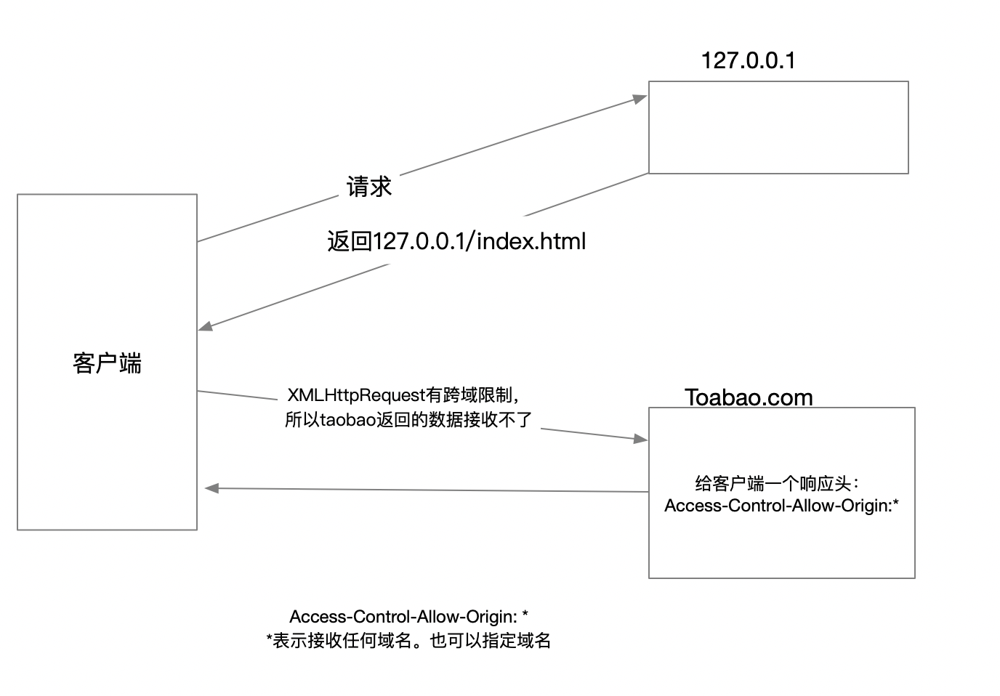

# 1. 跨域
+ 跨域概念：从a站点获取一个页面，然后在这个页面上去访问b站点的资源，就会发生跨域
+ 同源：必须相同协议，相同域名，相同端口；同源情况下就不存在跨域了。

```js
// 跨域示例
客户端以XMLHttpRequest对象访问`http://www.tianmao.com`, 天猫返回给客户端，在`http://www.tianmao.com`域名网页中，有一端js代码请求`http：//www.jd.com`，这时候请求京东网址，会发生跨域，因为浏览器有安全限制，请求发出去，但是数据回不来；浏览器对XMLHttpRequest对象跨域请求有限制，但是对script标签没有限制
```
+ 备注：浏览器对通过script标签访问其他域名是没有限制的。（比如平时jquery库的引入，就是script标签跨域，但是浏览器没有限制）

# 2. 跨域解决方案
## 2.1 jsonp跨域
+ jsonp的底层实现：通过`script标签`发送请求
+ jsonp跨域弊端：只支持`get`请求方式，因为它是使用script标签去发送请求的；而且服务器端需要做处理，客户端也需要做处理；如果跨域时传递的参数非常多，那么这种方式不可取。
+ 
```html
<!-- 示例1：此时服务器是返回数据了，但是报错语法错误SyntaxError，因为我们是以script的方式请求的，所以服务器返回的数据，客户端就会以js的方式去解析 -->
<script>
    document.querySelector('input').onclick = function(){
        var script = document.creatElement("script");
        script.src = "http：//www.jd.com/index.php";
        document.body.appendChild(script);
    }
</script>

<!-- 示例2：可以将客户端的回调函数作为参数传递给服务器端，让服务器端返回函数调用的字符串形式 -->
<script>
    function getInfo(data){
        // 处理服务器返回数据
        console.log(data);
    }
    document.querySelector('input').onclick = function(){
        var script = document.creatElement("script");
        script.src = "http：//www.jd.com/index.php?callback=getInfo";   // 需要服务器返回 "getInfo(返回数据)" 这样客户端就可以以js代码解析成函数调用处理
        document.body.appendChild(script);
    }
</script>
```
## 2.2 cors跨域
+ 备注：跨域时，请求可以发出去，但是数据回不来；
+ 原理：跨域资源共享，请求服务器时，服务器给一个响应头`Access-Control-Allow-Origin`，告诉客户端响应头中给的域名下的数据可以访问
+ cors和jsonp跨域的区别：
    - jsonp：是早期的一种跨域方案，是script标签实现，兼容性更好，但只支持get方式；
    - cors：是后期一种跨域方案，只需要服务器配置响应头，客户端不做处理，并且支持get和post方式；但是兼容性稍微差一些，因为`Access-Control-Allow-Origin`是http协议后期规定的，有些浏览器可能不支持这个响应头
```js
// cors用法: *表示接收任何域名。也可以指定域名`Access-Control-Allow-Origin: http://www.jd.com`, 表示接受京东的请求
跨域的服务端添加响应头：`Access-Control-Allow-Origin: *`
header("Access-Control-Allow-Origin: *")
```



